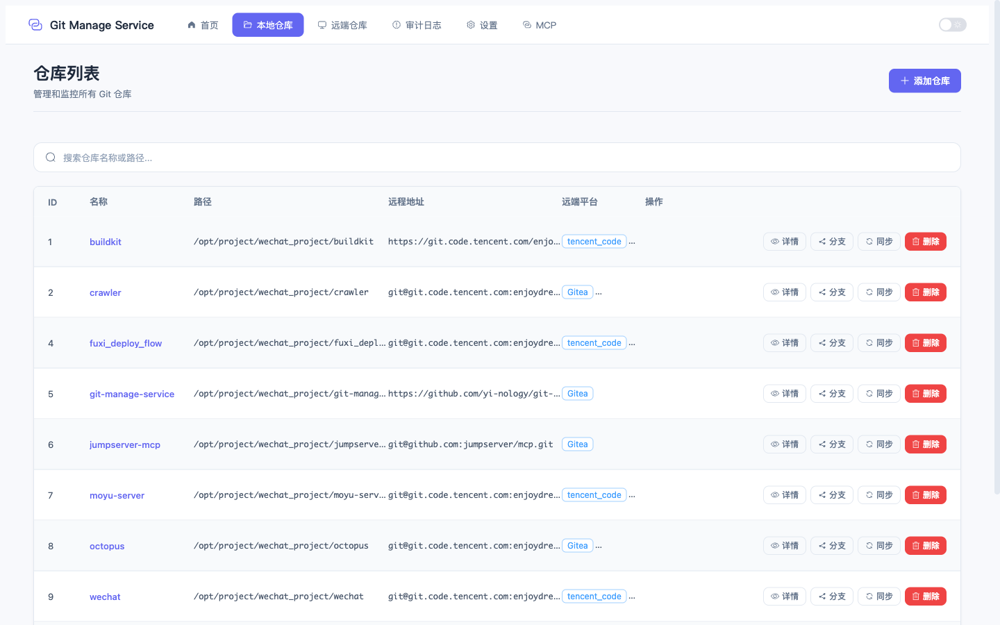
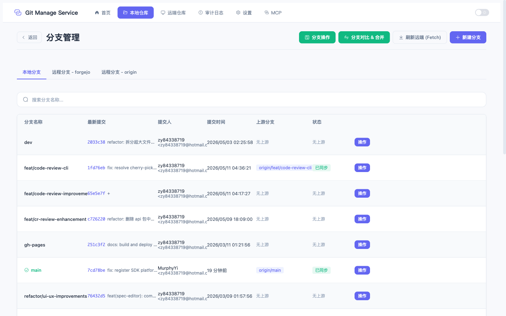
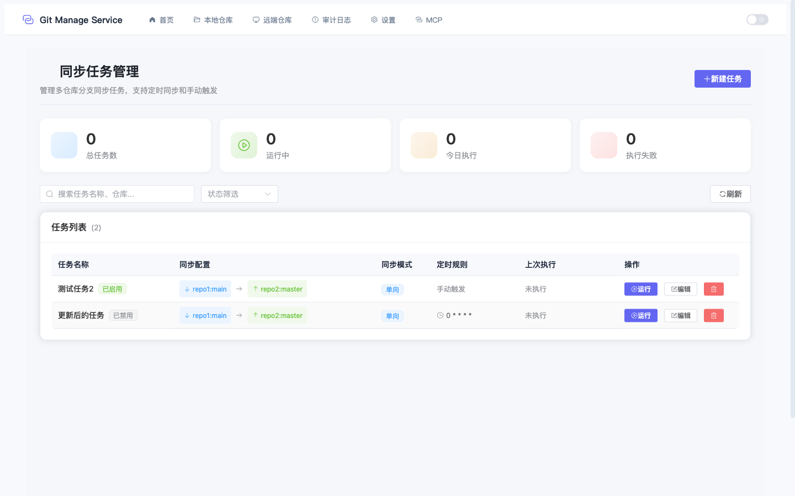
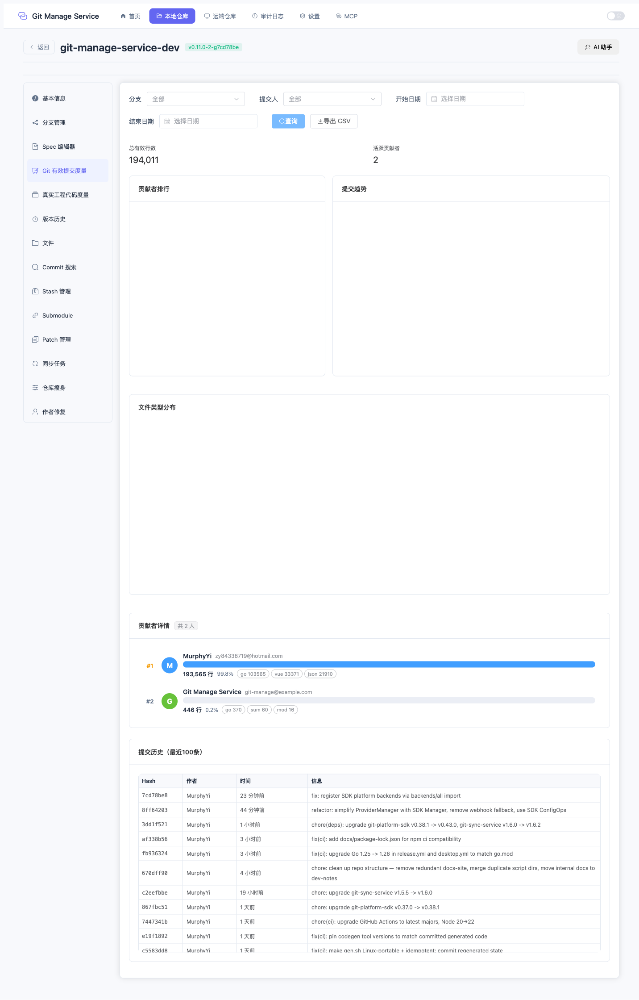
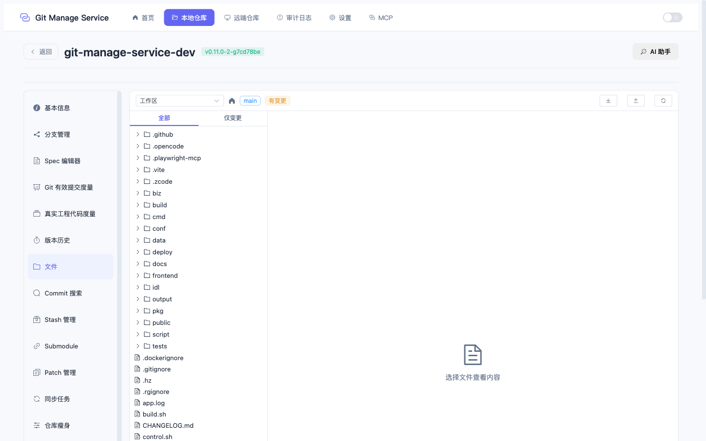
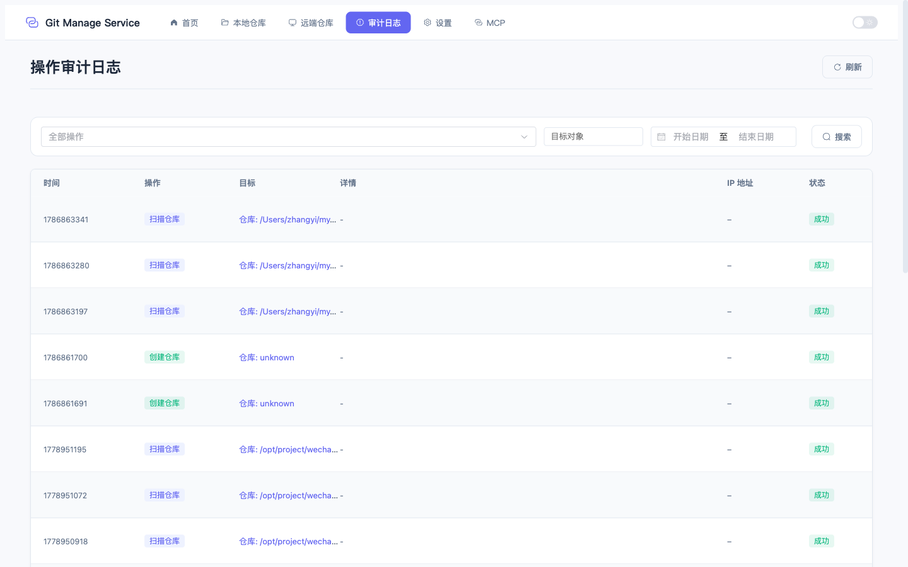

<p align="center">
  
</p>

<h1 align="center">Git Manage Service</h1>

<p align="center">
  <strong>轻量级多仓库自动化同步管理系统</strong>
</p>

<p align="center">
  <a href="https://github.com/yi-nology/git-manage-service/releases">
    
  </a>
  <a href="https://github.com/yi-nology/git-manage-service/blob/main/LICENSE">
    
  </a>
  <a href="https://github.com/yi-nology/git-manage-service/actions">
    
  </a>
  
  
  
</p>

<p align="center">
  <a href="#-快速开始">快速开始</a> •
  <a href="#-核心能力">核心能力</a> •
  <a href="#-界面预览">截图</a> •
  <a href="#-开发">开发</a> •
  <a href="#-文档">文档</a>
</p>

---

## 为什么选择 Git Manage Service？

管理多个 Git 仓库的同步、监控和自动化是一件繁琐的事情。Git Manage Service 提供了 **130+ API 接口**、**35+ 页面**、**8 项 AI 能力** 的一站式解决方案：

- **一个面板管理所有仓库** — 注册本地仓库，集中查看分支、提交、标签、文件树
- **灵活配置同步规则** — 任意 Remote 和分支之间的双向同步，支持定时调度
- **AI 驱动的代码审查** — 规则引擎 + LLM 语义分析，自动 Review 并评论到 MR/PR
- **8 项 AI 能力** — 冲突解决、提交消息生成、Spec 修复、代码审查、仓库瘦身建议等
- **多平台对接** — GitHub / GitLab / Gitea，自动识别、CR 管理、Webhook 联动
- **6 种通知渠道** — 钉钉、企微、飞书、蓝信、邮件、Webhook

## ✨ 核心能力

### 📦 仓库管理

| 能力 | 说明 |
|------|------|
| 仓库注册与克隆 | 手动注册本地仓库、从远程克隆、批量克隆、目录扫描 |
| 文件浏览器 | 浏览仓库文件树，支持 `worktree` 模式查看未跟踪文件 |
| 分支管理 | 创建/删除/切换分支，分支对比、合并、Rebase、Cherry-pick |
| 提交管理 | 提交详情、Diff 查看、提交搜索 |
| 标签管理 | 创建/删除/推送标签（轻量标签 + 附注标签） |
| Stash 管理 | 保存/弹出/应用/清除工作区暂存 |
| Patch 管理 | 生成/保存/应用/下载补丁，支持干运行检查 |
| 子模块管理 | 添加/初始化/更新/同步/移除子模块 |
| 工作区操作 | Stage/Unstage/Commit/Push/Pull，冲突检测与解决 |

### 🔄 同步引擎

| 能力 | 说明 |
|------|------|
| 灵活同步规则 | 任意 Remote + 分支组合，支持单分支/全分支同步 |
| Cron 定时调度 | 内置 Cron 服务，无人值守自动执行同步任务 |
| 批量同步 | 一键批量执行多个同步任务 |
| 干运行预览 | 执行前预览变更，确认无误后再同步 |
| 同步历史 | 完整的同步执行记录，支持历史查询和清理 |
| 分布式锁 | 内存锁 / Redis / DB 锁，防止并发同步冲突 |
| 同步分析 | 基于提交频率分析，推荐最优同步策略 |

### 🔔 通知系统

| 能力 | 说明 |
|------|------|
| 邮件通知 | SMTP 邮件发送 |
| 钉钉 | 钉钉机器人 Webhook |
| 企业微信 | 企微机器人 Webhook |
| 飞书 | 飞书机器人 Webhook |
| 蓝信 | 蓝信机器人 Webhook |
| 通用 Webhook | 自定义 HTTP 回调 |
| 模板引擎 | Go template 自定义标题/内容，支持变量替换和辅助函数 |
| 事件触发 | `sync_success` / `sync_failure` / `sync_conflict` / `backup_success` / `backup_failure` |

### 🔍 代码审查

| 能力 | 说明 |
|------|------|
| 规则引擎 | 5 条内置规则：密钥检测、受保护文件、Diff 大小、迁移文件、测试覆盖 |
| LLM 审查 | AI 语义分析，发现规则引擎无法覆盖的问题 |
| 风险评级 | 自动将发现聚合为 critical/high/medium/low/info 五级 |
| 合并检查 | 合并门禁，高风险发现可自动阻止合并 |
| 评论回推 | 将审查结果评论到 GitLab MR / GitHub PR |
| 仓库级配置 | 每个仓库独立配置审查策略、规则、LLM Provider |
| 自动触发 | Webhook 收到 MR/PR 创建事件时自动发起审查 |

### 🤖 AI 能力（8 项）

| 能力 | 说明 |
|------|------|
| Spec AI 助手 | 对话式问答、代码补全、Agent 模式编辑 Spec 文件 |
| Spec AI 修复 | 针对具体 Lint 问题自动生成修复建议 |
| AI Lint | LLM 驱动的 Spec 语义分析（依赖完整性、宏正确性、安全检查等） |
| AI 代码审查 | LLM 分析代码变更，输出结构化审查意见 |
| AI 冲突解决 | 智能三方合并，自动解决 Merge 冲突 |
| AI 提交消息 | 根据暂存区 Diff 自动生成提交消息 |
| AI 仓库瘦身 | 分析仓库健康报告，推荐大文件清理策略 |
| AI 作者归因 | 扫描识别错误归属的提交，AI 辅助修复 |

**LLM Provider 支持：**

| 类型 | 说明 |
|------|------|
| OpenAI 兼容 | 覆盖大部分主流 API |
| Anthropic Claude | Claude 原生 API |
| Google Gemini | Gemini API |
| Ollama | 本地模型推理 |

内置 20+ 预设：阿里云百炼、智谱 GLM、火山方舟、腾讯云、MiniMax、Kimi、DeepSeek、百度文心、讯飞星火、OpenAI、Claude、Gemini、Mistral、Ollama、vLLM 等。

### 🌐 多平台对接

| 能力 | 说明 |
|------|------|
| GitHub | 仓库、分支、PR、评论、Commit Status |
| GitLab | 仓库、分支、MR、评论、Pipeline Status |
| Gitea | 兼容 API |
| 自动识别 | 从 Remote URL 自动检测平台类型（SSH/HTTPS） |
| 平台绑定 | 本地仓库 ↔ 远程平台绑定，自动关联 |
| CR 管理 | 创建/列表/合并/关闭 MR/PR，本地缓存 |
| Webhook 集成 | 接收平台事件 → 规则匹配 → 自动执行同步/通知/审查 |
| 分支保护 | 查询和配置远程平台分支保护规则 |

### 🔐 凭证与安全

| 能力 | 说明 |
|------|------|
| 凭证管理 | 用户名/密码、API Token、SSH 密钥统一管理 |
| SSH 密钥 | 上传/生成/测试 SSH 密钥，系统级和数据库级双管理 |
| 凭证匹配 | 根据 Remote URL 自动匹配合适的凭证 |
| 密钥格式化 | 自动规范化 SSH 密钥格式 |
| 审计日志 | 全量 API 操作记录，含操作者、IP、User-Agent |

### 📊 代码度量

| 能力 | 说明 |
|------|------|
| 提交统计 | 提交频率、代码变更量统计 |
| 贡献者排行 | 按提交数/代码行数排行 |
| 代码行计数 | 多语言代码/注释/空行统计（30+ 语言） |
| Blame 归因 | 基于 Git Blame 的按作者行数归因 |
| CSV 导出 | 统计数据导出为 CSV |
| 分支统计 | 各分支提交和变更统计 |

### 🔧 Spec 规则引擎

| 能力 | 说明 |
|------|------|
| Spec 文件管理 | 浏览/编辑/创建/删除/提交 `.spec` 文件 |
| 规则 Lint | 基于数据库规则的模式匹配检查，支持自定义规则 |
| AI Lint | LLM 语义分析 |
| 格式化 | 12 项格式化选项：URL 规范化、依赖排序、SPDX License、宏替换等 |
| Monaco 编辑器 | 内嵌 VSCode 级别编辑器，实时 Lint 高亮 |
| rpmlint 集成 | 可选调用外部 `rpmlint` 工具 |

### 🏗 仓库维护

| 能力 | 说明 |
|------|------|
| 健康检查 | `.git` 目录大小分析、松散对象、大文件检测 |
| 垃圾回收 | `git gc` 一键执行 |
| 仓库瘦身 | 基于 BFG 的历史大文件清理 |
| .gitignore | 智能生成 `.gitignore` 建议 |
| AI 分析 | LLM 分析健康报告，推荐清理策略 |
| 维护记录 | 完整的维护操作历史 |

### ✍️ 作者身份管理

| 能力 | 说明 |
|------|------|
| 身份管理 | 创建/编辑作者身份，支持别名 |
| 归因扫描 | 扫描仓库中错误归属的提交 |
| 批量修复 | 一键修复所有作者归因问题 |
| AI 辅助 | AI 分析作者问题并提供修复建议 |

### 🖥️ 部署形态

| 形态 | 说明 |
|------|------|
| Web 服务 | HTTP + RPC 双协议，端口 12345 / 8888 |
| 桌面应用 | Wails 原生客户端，macOS / Windows / Linux |
| Docker | 多阶段构建镜像，支持 SQLite / MySQL / PostgreSQL |
| Docker Compose | 提供三种数据库方案的一键部署配置 |

## 📸 界面预览

| 仓库管理 | 分支操作 |
|:---:|:---:|
|  |  |

| 同步任务 | 代码度量 |
|:---:|:---:|
|  |  |

| 文件浏览 | 审计日志 |
|:---:|:---:|
|  |  |

更多截图请查看 [文档](docs/README.md)。

## 🚀 快速开始

### 方式 1：桌面应用（推荐）

从 [Releases](https://github.com/yi-nology/git-manage-service/releases) 下载对应平台安装包：

| 平台 | 文件 | 说明 |
|------|------|------|
| **macOS** | `GitManageService-macOS.zip` | Universal Binary (Intel + Apple Silicon) |
| **Windows** | `GitManageService-Windows.zip` | 包含安装程序 |
| **Linux** | `GitManageService-Linux.tar.gz` | DEB / RPM / AppImage |

```bash
# macOS
unzip GitManageService-macOS.zip
open "Git Manage Service.app"

# Linux
tar -xzf GitManageService-Linux.tar.gz
sudo dpkg -i git-manage-desktop.deb
```

### 方式 2：Web 服务

```bash
# 从 Releases 下载
wget https://github.com/yi-nology/git-manage-service/releases/latest/download/git-manage-service-$(uname -s)-$(uname -m).tar.gz

# 解压并运行
tar -xzf git-manage-service-*.tar.gz
./git-manage-service --mode=http

# 访问 http://localhost:12345
```

### 方式 3：Docker

```bash
docker run -d \
  --name git-manage-service \
  -p 12345:12345 \
  -v $(pwd)/data:/app/data \
  ghcr.io/yi-nology/git-manage-service:latest
```

## 🛠 技术栈

**后端**

| 技术 | 说明 |
|------|------|
| [Go 1.25](https://go.dev/) | 主语言 |
| [CloudWeGo Hertz](https://github.com/cloudwego/hertz) | HTTP 框架 |
| [CloudWeGo Kitex](https://github.com/cloudwego/kitex) | RPC 框架 |
| [GORM](https://gorm.io/) + SQLite / MySQL / PostgreSQL | ORM + 多数据库 |
| [go-git](https://github.com/go-git/go-git) | 纯 Go Git 实现 |
| [Wails](https://wails.io/) | 桌面应用框架 |
| [robfig/cron](https://github.com/robfig/cron) | 定时任务调度 |

**前端**

| 技术 | 说明 |
|------|------|
| [Vue 3](https://vuejs.org/) + [TypeScript](https://www.typescriptlang.org/) | UI 框架 |
| [Element Plus](https://element-plus.org/) | 组件库 |
| [Pinia](https://pinia.vuejs.org/) | 状态管理 |
| [Monaco Editor](https://microsoft.github.io/monaco-editor/) | 代码编辑器 |
| [ECharts](https://echarts.apache.org/) | 数据可视化 |
| [Vite](https://vitejs.dev/) | 构建工具 |

## 🔧 开发

### 环境要求

- Go 1.25+（需 CGO）
- Node.js 18+

### 本地开发

```bash
# 克隆仓库
git clone https://github.com/yi-nology/git-manage-service.git
cd git-manage-service

# 安装依赖
go mod tidy
cd frontend && npm install && cd ..

# 一键构建（前端 + 后端）
make build-full

# 运行
./output/git-manage-service --mode=http

# 或前后端分离开发
# 终端 1：后端
./output/git-manage-service --mode=http

# 终端 2：前端（自动代理 API 请求）
cd frontend && npx vite --host 0.0.0.0 --port 5173
```

### 常用命令

```bash
make build-full          # 完整构建（前端 + 后端）
make build               # 仅构建后端
make test                # 运行测试
make fmt                 # 格式化代码
make lint                # 代码检查
make desktop             # 构建桌面应用
make help                # 查看所有命令
```

## 📡 MCP 服务对接

Git Manage Service 提供基于 TCP 的 MCP (Model Context Protocol) 服务，支持与 AI Agent 和外部工具集成。

默认端口：**9000**

```bash
# 快速测试：获取分支列表
echo '{"tool":"git_branches","parameters":{"path":"/path/to/repo"}}' | nc localhost 9000
```

**支持的工具：** `git_clone`、`git_fetch`、`git_push`、`git_checkout`、`git_branches`、`git_status`、`git_log`、`git_add`、`git_commit`、`git_auth`、`notification_send`、`sync_task`、`sync_run`

详见 [MCP 对接文档](docs/features/mcp.md)。

## 📖 文档

| 文档 | 说明 |
|------|------|
| [快速开始](docs/getting-started.md) | 5 分钟完成安装和配置 |
| [功能指南](docs/README.md) | 详细的功能使用说明 |
| [部署方案](docs/deployment/binary.md) | 生产环境部署指南 |
| [配置参考](docs/configuration.md) | 完整的配置项说明 |
| [API 文档](docs/api.md) | HTTP API 接口参考 |
| [Webhook 集成](docs/features/webhook.md) | 外部触发同步 |
| [MCP 对接](docs/features/mcp.md) | MCP 服务对接指南 |

## 🤝 参与贡献

欢迎提交 Issue 和 Pull Request！

1. Fork 本仓库
2. 创建特性分支 (`git checkout -b feature/amazing-feature`)
3. 提交更改 (`git commit -m 'Add amazing feature'`)
4. 推送到分支 (`git push origin feature/amazing-feature`)
5. 创建 Pull Request

## 📄 许可证

本项目基于 [MIT License](LICENSE) 开源。

Copyright (c) 2025 murphyyi

---

<p align="center">
  如果这个项目对你有帮助，请给一个 ⭐ Star 支持一下！
</p>
