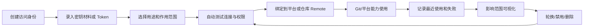

# Git 认证与平台凭证生命周期设计

## 背景

当前 SSH 密钥、Git 网站 token、账号密码、平台配置、仓库 remote 凭证分散在多个入口中：

- `SSH 密钥管理`：维护数据库内保存的 SSH 私钥。
- `凭证管理`：维护 Git clone/fetch/push 使用的 credential。
- `平台配置`：维护 GitLab/GitHub/Gitea API 集成，并引用一个 credential 作为 API token。
- `仓库克隆/注册/编辑`：再单独选择默认凭证或 remote 专属凭证。
- 部分后端操作仍走旧字段 `auth_type/auth_key/auth_secret/remote_auths`。

用户感知上会变成三个问题：

1. 不知道应该先建 SSH 密钥、凭证，还是平台配置。
2. 不知道一个 token/密钥被哪些仓库、平台、同步任务引用。
3. 不知道改密钥、删密钥、换 token 后哪些能力会受影响。

目标是把它设计成一个完整闭环：创建、验证、绑定、使用、观测、轮换、删除都能在同一生命周期里完成。

## 现状对象

### SSHKey

模型位置：`biz/model/po/ssh_key.go`

含义：数据库中保存的 SSH 私钥素材。

关键字段：

- `name`
- `private_key`
- `public_key`
- `passphrase`
- `key_type`

它本质上是“密钥材料”，不是完整业务凭证。完整凭证还需要用途、匹配范围、引用关系和测试状态。

### Credential

模型位置：`biz/model/po/credential.go`

含义：统一 Git 认证对象。

当前支持：

- `ssh_key`
- `http_basic`
- `http_token`
- 后端创建校验里还允许 `platform_token`，但前端类型未暴露。

关键字段：

- `name`
- `type`
- `ssh_key_id`
- `ssh_key_path`
- `username`
- `secret`
- `url_pattern`
- `last_used_at`
- `platform`
- `platform_scope`

问题是 `platform/platform_scope` 已存在但几乎没有进入前端体验，平台 API token 与 Git HTTP token 在交互上也没有清晰区分。

### ProviderConfig

模型位置：`biz/model/po/provider_config.go`

含义：GitHub/GitLab/Gitea 平台 API 集成配置。

关键字段：

- `platform`
- `base_url`
- `credential_id`
- `webhook_secret`
- `skip_tls`

平台配置通过 `credential_id` 取 token。后端 `biz/service/provider/manager.go` 直接使用 `cred.Secret` 作为 API token，因此平台配置实际只能安全引用 token 类凭证，但当前前端下拉没有按类型过滤。

### Repo

模型位置：`biz/model/po/repo.go`

含义：本地仓库配置。

新凭证字段：

- `default_credential_id`
- `remote_credentials`

旧认证字段仍在：

- `auth_type`
- `auth_key`
- `auth_secret`
- `remote_auths`

新旧字段并存导致后端调用路径不一致。

## 当前引用点

### 前端入口

| 入口 | 文件 | 当前行为 | 问题 |
| --- | --- | --- | --- |
| 设置首页 | `frontend/src/views/settings/SettingsPage.vue` | `SSH 密钥`、`凭证管理`、`平台配置` 分成三个卡片 | 用户不知道三者关系，入口层级错误 |
| 路由 | `frontend/src/router/index.ts` | `/settings/ssh-keys`、`/settings/credentials`、`/settings/platforms` 独立 | 生命周期被拆散 |
| SSH 密钥页 | `frontend/src/views/settings/SSHKeysPage.vue` | 管理 DB SSH key，支持查看/编辑/测试/删除 | 它被当成独立业务对象展示，但实际常作为 credential 的素材 |
| SSH 密钥弹窗 | `frontend/src/components/settings/SSHKeyDialogs.vue` | 创建/编辑/测试/删除 SSHKey | 删除前缺少“被哪些 credential 引用”的强提示 |
| 凭证列表 | `frontend/src/views/settings/CredentialPage.vue` | 展示所有 credential，页面底部有全局测试区 | 无引用关系、无用途分类、无生命周期状态 |
| 凭证编辑页 | `frontend/src/views/settings/AddCredentialPage.vue` | 支持 SSH/HTTP basic/token，SSH 可选 DB key 或本地路径 | 与 `CredentialForm.vue` 重复；创建 SSH 凭证时又要先去另一个页面建 DB key |
| 凭证表单组件 | `frontend/src/components/credential/CredentialForm.vue` | 另一套凭证表单 | 当前似乎不是主入口，增加维护成本 |
| 凭证卡片 | `frontend/src/components/credential/CredentialCard.vue` | 展示类型、匹配 URL、SSH key、用户名、secret 状态 | 没展示平台引用、仓库引用、测试状态、轮换状态 |
| 凭证选择器 | `frontend/src/components/credential/CredentialSelector.vue` | 按 URL 推荐 credential | 不区分用途：Git remote 凭证、平台 API token、SSH 素材会混在一起 |
| 平台配置 | `frontend/src/views/settings/PlatformConfigPage.vue` | 平台配置引用 credential | 未过滤 token 类型，用户可能选 SSH 凭证；新建平台时无法顺手创建 token |
| 克隆仓库 | `frontend/src/views/repo/RepoClonePage.vue` | 选择 `credential_id`，成功后写入 `default_credential_id` | 可以从远端仓库带入 provider 信息，但凭证选择没有“使用该平台 token/推荐 SSH key”的闭环 |
| 注册本地仓库 | `frontend/src/views/repo/RepoRegisterPage.vue` | 单仓库选择默认凭证 | 未基于扫描出的 remote URL 推荐，`remoteUrl` 表单值没有保存进创建请求 |
| 批量注册 | `frontend/src/components/repo/BatchRegisterPanel.vue` | 对所有选中仓库设置同一个默认凭证 | 多 remote、多平台场景下粒度不足 |
| 编辑仓库页 | `frontend/src/views/repo/EditRepoPage.vue` | 设置默认凭证、remote 专属凭证、平台绑定 | 是目前最接近闭环的页面，但配置分散且与平台绑定关系没有打通 |
| 编辑仓库弹窗 | `frontend/src/components/repo/RepoEditDialog.vue` | 另一套仓库编辑逻辑 | 与 `EditRepoPage.vue` 重复，凭证测试逻辑重复 |
| RemoteCard | `frontend/src/components/repo/RemoteCard.vue` | remote 内选择 credential | 看起来是局部组件，但引用范围有限 |

### 后端使用点

| 使用点 | 文件 | 当前行为 | 问题 |
| --- | --- | --- | --- |
| Credential CRUD | `biz/handler/credential/credential_crud_handler.go` | 创建/更新/删除 credential | 更新接口空值无法清空字段；删除只检查 Repo/ProviderConfig，未给前端完整影响范围接口 |
| Credential Test/Match | `biz/handler/credential/credential_test_handler.go` | 测试连接、按 URL 推荐凭证 | 推荐只按 URL/协议，未按用途、平台、权限、scope、上次成功状态排序 |
| Credential DAO | `biz/dal/db/credential_dao.go` | 查找、匹配、更新时间 | `FindMatchingURL` 只做 host 与协议匹配，无法表达 provider/repo/owner scope |
| AuthService | `biz/service/auth/auth_service.go` | 新凭证解析与旧 auth 回退 | 这是应该统一复用的核心，但还有调用方没有走它 |
| 克隆 | `biz/handler/repo/repo_clone_handler.go` | 优先 `credential_id`，其次 `ssh_key_id`，再旧 auth 参数 | 还保留直接 `ssh_key_id` 和旧字段入口，生命周期不单一 |
| 同步 fetch/push | `biz/service/sync/sync_service.go` | 使用 `ResolveCredentialForRemote`，支持 remote 专属凭证与默认凭证 | 这条路径相对合理，可作为统一方向 |
| 分支 push/pull | `biz/handler/branch/branch_sync_handler.go` | 仍只读旧 `remote_auths/auth_type/auth_key/auth_secret` | 已配置的新 credential 可能不会被这里使用，是明显断点 |
| 平台 ProviderManager | `biz/service/provider/manager.go` | 通过 provider config 的 `credential_id` 取 `cred.Secret` 做 API token | 未校验 credential 类型和 scope |
| 迁移 | `biz/dal/db/migration.go` | SSHKey 和旧 repo auth 自动迁移到 Credential | 迁移方向是对的，但 UI 仍让 SSHKey 与 Credential 平级 |

## 主要发现

### 1. 概念层级倒置

`SSHKey` 是密钥材料，`Credential` 才是业务凭证。但当前设置页把 `SSH 密钥` 和 `凭证管理` 并列，用户会误以为两者是替代关系。

建议层级：

- 一级：`访问凭证`
- 二级 Tab：
  - `Git 凭证`
  - `平台 Token`
  - `SSH 密钥材料`
  - `引用与审计`

SSH 密钥材料可以被高级用户直接管理，但主流程应该允许在创建 SSH credential 时内联创建/导入 SSH key。

### 2. 平台 token 与 Git token 混在一起

平台 API token 用于调用 GitHub/GitLab/Gitea API：列仓库、CR、Webhook、分支保护等。

Git HTTP token 用于 `git clone/fetch/push`。

它们可能使用同一个真实 token，但用途、测试方式、权限要求、错误提示完全不同。当前 `Credential` 只有 `http_token`，平台配置下拉也不区分用途。

建议新增或正式启用：

- `purpose`: `git_remote` / `provider_api` / `both`
- `provider`: `github` / `gitlab` / `gitea`
- `base_url` 或 `host`
- `scope`: owner/repo pattern，可选
- `capabilities`: `repo_read`、`repo_write`、`cr_read`、`cr_write`、`webhook_admin`

### 3. 缺少引用关系视图

删除 credential 时后端会检查 Repo 和 ProviderConfig 引用，但前端看不到引用图。用户也不知道一个凭证被用于：

- 哪些本地仓库的默认凭证
- 哪些 remote 的专属凭证
- 哪些平台配置
- 哪些远端仓库绑定
- 哪些同步任务或 CR 自动化间接受影响

建议提供 `GET /credentials/:id/usages`：

```json
{
  "reposDefault": [],
  "repoRemotes": [],
  "providers": [],
  "bindings": [],
  "syncTasks": [],
  "webhookRules": []
}
```

删除、禁用、轮换前都先展示影响范围。

### 4. 生命周期状态缺失

Credential 当前只有 `last_used_at`，没有记录：

- 最近一次测试结果
- 最近一次失败原因
- 权限探测结果
- token 过期时间
- 是否禁用
- 是否需要轮换
- 创建来源

建议补齐状态字段或新增状态表：

- `status`: `active` / `invalid` / `disabled` / `rotating`
- `last_tested_at`
- `last_test_success`
- `last_error`
- `last_used_at`
- `expires_at`
- `rotated_at`
- `created_from`: `manual` / `migration` / `provider_setup` / `repo_clone`

### 5. 新旧认证路径并存，且部分路径没有接入新凭证

`SyncService` 已走 `ResolveCredentialForRemote`，优先级清楚：

1. remote 专属 credential
2. repo 默认 credential
3. 旧 remote auth
4. 旧默认 auth

但 `branch_sync_handler.go` 的 push/pull 仍直接读旧 `remote_auths/auth_type/auth_key/auth_secret`，这会让用户在仓库编辑页设置的新凭证对部分分支操作不生效。

建议所有 Git 操作都只通过同一个解析入口：

```go
ResolveCredentialForRemote(repo, remoteName)
```

并把旧字段只作为迁移兼容层，不再暴露给前端。

### 6. 表单和页面重复

凭证表单至少存在两套：

- `frontend/src/views/settings/AddCredentialPage.vue`
- `frontend/src/components/credential/CredentialForm.vue`

仓库编辑也有两套：

- `frontend/src/views/repo/EditRepoPage.vue`
- `frontend/src/components/repo/RepoEditDialog.vue`

这会让交互修复变成多点维护。建议收敛到单一组件，再由页面/弹窗复用。

## 目标闭环

### 生命周期主线



### 用户旅程 1：配置 GitHub 平台

1. 进入 `访问凭证`。
2. 点击 `添加平台 Token`。
3. 选择平台 `GitHub`，填写 API 地址和 token。
4. 系统测试 `/user`，并探测权限：列仓库、读 PR、创建 webhook。
5. 创建或选择 `平台配置`，自动引用该 token。
6. 进入远端仓库列表，选择仓库 clone。
7. clone 时根据远端 URL 推荐 Git 凭证：
   - HTTPS：优先推荐同 host、同 owner scope 的 Git token。
   - SSH：优先推荐同 host 的 SSH credential。
8. clone 成功后自动建立本地 repo、provider binding、默认 credential。

### 用户旅程 2：导入 SSH 私钥并用于多个仓库

1. 进入 `访问凭证 > Git 凭证`。
2. 点击 `添加 SSH 凭证`。
3. 选择 `导入私钥` 或 `引用本地文件`。
4. 如果导入私钥，系统自动生成 public key、指纹、key type。
5. 设置作用范围：例如 `github.com/org/*`。
6. 测试一个 remote URL。
7. 保存后在仓库注册、克隆、编辑 remote 时自动推荐。
8. 在凭证详情页能看到被哪些 repo/remote 使用。

### 用户旅程 3：轮换 token

1. 打开 credential 详情。
2. 查看引用范围和最近失败。
3. 点击 `轮换 Secret`。
4. 输入新 token/password/passphrase。
5. 系统按用途执行测试：
   - provider API token：测试平台 API 权限。
   - Git HTTP token：对引用到的 remote 执行 `ls-remote`。
   - SSH：对引用到的 remote 执行 SSH/Git 测试。
6. 测试通过后保存新 secret。
7. 状态记录 `rotated_at`，引用关系不变。

## 推荐信息架构

### 设置页

把当前三个入口收敛为：

- `访问凭证`
- `平台集成`

其中 `平台集成` 只管理平台本身：平台类型、API 地址、Webhook、TLS、默认行为。平台 token 的创建/轮换在 `访问凭证` 中完成，也可以从平台集成弹窗内联触发。

### 访问凭证页

建议页面结构：

- 顶部统计：
  - 全部
  - 正常
  - 失败
  - 即将过期
  - 未使用
- 筛选：
  - 用途：Git remote / 平台 API / Both
  - 类型：SSH / Token / 账号密码
  - 平台：GitHub / GitLab / Gitea / 自定义
  - 状态
- 列表字段：
  - 名称
  - 用途
  - 类型
  - 作用范围
  - 最近测试
  - 最近使用
  - 引用数量
  - 操作：测试、轮换、编辑、禁用、删除

### Credential 详情页

详情页应该是闭环核心：

- 基本信息
- Secret 状态：已配置/未配置、过期时间、轮换时间
- 权限探测结果
- 使用范围
- 引用关系
- 最近测试日志
- 操作区：
  - 测试
  - 轮换 Secret
  - 修改作用范围
  - 禁用
  - 删除

### SSH 密钥材料页

不再作为主入口，可以放在 `访问凭证 > SSH 密钥材料`：

- 展示 SSHKey 本身。
- 展示由它派生的 credential。
- 如果没有 credential，提示 `创建 SSH 凭证`。
- 删除前必须展示引用它的 credential，再由 credential 展示 repo/provider 引用。

## 推荐数据模型调整

短期可以不大改表，先在 `credentials` 上补字段：

- `purpose`
- `provider`
- `base_url`
- `host`
- `scope`
- `status`
- `last_tested_at`
- `last_test_success`
- `last_error`
- `expires_at`
- `rotated_at`
- `disabled_at`

中期建议把 secret 版本化：

```text
credentials
credential_secrets
credential_usages 或通过查询实时生成 usage
credential_test_results
```

`credential_secrets` 价值：

- 支持轮换历史。
- 支持新 secret 测试通过后再切换。
- 避免直接覆盖导致所有引用同时失效。

## 推荐 API 调整

### 查询

- `GET /credentials?purpose=&type=&provider=&status=`
- `GET /credentials/:id`
- `GET /credentials/:id/usages`
- `GET /credentials/:id/test-results`
- `POST /credentials/match`

`match` 请求建议包含用途：

```json
{
  "url": "git@github.com:org/repo.git",
  "purpose": "git_remote",
  "providerConfigId": 1,
  "repoKey": "..."
}
```

### 写入

- `POST /credentials`
- `PUT /credentials/:id`
- `POST /credentials/:id/test`
- `POST /credentials/:id/rotate`
- `POST /credentials/:id/disable`
- `POST /credentials/:id/enable`
- `DELETE /credentials/:id`

### 平台配置

平台配置保存时应校验：

- `credential_id` 必须存在。
- credential 用途必须是 `provider_api` 或 `both`。
- credential 类型必须是 token 类。
- credential 的 provider/base_url 与平台配置匹配，除非用户确认 override。

## 分阶段改造建议

### 第一阶段：交互收敛，不大动库表

1. 新增 `访问凭证` 页面，整合现有 `CredentialPage`、`AddCredentialPage`、`SSHKeysPage` 的能力。
2. 保留旧路由，但重定向到新页面的对应 Tab。
3. 平台配置中的 credential 下拉只展示 token/http 类凭证，并提供 `新建 Token` 内联入口。
4. Git remote 的 CredentialSelector 增加 `purpose="git_remote"`，过滤掉平台专用 token。
5. 删除 `CredentialForm.vue` 或让 `AddCredentialPage.vue` 复用它，避免双表单。
6. 删除/禁用 credential 前展示当前后端已能查到的 Repo/ProviderConfig 引用。

### 第二阶段：后端统一认证解析

1. 改造 `branch_sync_handler.go`，让 branch push/pull 走 `ResolveCredentialForRemote`。
2. 克隆接口废弃直接 `ssh_key_id/auth_type/auth_key/auth_secret` 入参，只保留 `credential_id`；旧字段仅兼容老客户端。
3. 所有 Git 操作统一经过 AuthService。
4. `ProviderManager` 校验 credential 类型，避免 SSH credential 被当作 API token 使用。
5. 更新测试覆盖：
   - repo 默认凭证
   - remote 专属凭证
   - DB SSH key
   - HTTP token
   - 平台 token 类型校验

### 第三阶段：引用与状态闭环

1. 实现 `GET /credentials/:id/usages`。
2. 增加 test result 状态记录。
3. 凭证列表展示引用数量、最近测试状态、最近失败原因。
4. 删除动作改为：
   - 无引用：直接删除。
   - 有引用：禁止删除，提供跳转解除绑定。
   - 允许禁用，但提示影响范围。
5. SSHKey 删除前检查 Credential 引用，并引导先处理 Credential。

### 第四阶段：轮换与权限探测

1. 新增 `rotate` 流程。
2. Provider token 测试时探测权限。
3. Git credential 测试时支持批量测试所有引用 remote。
4. 支持 `expires_at` 和“即将过期”提醒。

## 关键验收标准

- 用户从零开始能按一条路径完成：创建 token/SSH 凭证 -> 测试 -> 绑定平台或仓库 -> 使用 -> 查看引用 -> 轮换。
- 平台配置不能选择 SSH 凭证。
- 仓库 remote 凭证选择不会出现平台专用 token，除非它被标记为 `both`。
- 任意 credential 详情都能看到引用它的 repo/provider。
- 任意删除/禁用/轮换操作前都能看到影响范围。
- branch push/pull、sync fetch/push、clone 使用同一套 credential 解析优先级。
- 旧 `auth_type/auth_key/auth_secret/remote_auths` 不再出现在新 UI 中，只作为迁移兼容。

## 优先修复点

1. `branch_sync_handler.go` 没有接入新 credential，是当前功能一致性风险最高的点。
2. `PlatformConfigPage.vue` 的 credential 下拉需要按 token 用途过滤，否则可能选错 SSH 凭证。
3. `CredentialPage.vue` 需要从卡片列表升级为带用途、状态、引用关系的管理页。
4. `SSHKeysPage.vue` 应下沉为 SSH 材料管理，不再与 Credential 平级。
5. `CredentialForm.vue` 和 `AddCredentialPage.vue` 应收敛为一套表单。
6. 删除 credential/SSHKey 前需要展示引用关系，不应只在后端返回第一条阻断错误。
